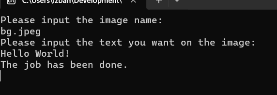

**When some people, such as designers, want to upload their demonstrating works to a website while simultaneously worrying that their works will be copied by someone else, this feature will be useful, as they can use this feature to add a watermark to the demonstrating works.**

---

**Key Points:**
1. Using the DrawString() method in the Graphic class to draw words at a specific position.
2. Using the Save() method in Bitmap class to save the modified pictures.

---
**Usage:**
1. Copy a image file to the directory where the WordsAndPictureCompounder.exe based on
2. To run WordsAndPictureCompounder.exe, then, to enter the image name and the words you want to show on the image.

